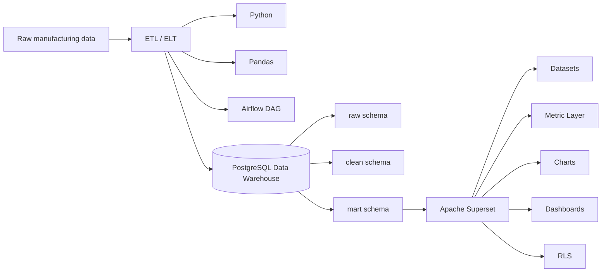

# Revised Flow Architecture

```text
Raw data
  ↓
ETL / ELT Layer
  ├─ Python / Pandas / Airflow
  ↓
Data Warehouse / Data Mart
  ├─ PostgreSQL
  ↓
Apache Superset
  ├─ Dataset
  ├─ Metric Layer
  ├─ Chart
  ├─ Dashboard
  └─ Role-based Access / Row-level Security
```

## 1. Raw data

The raw data layer uses the OBE03 manufacturing synthetic dataset. It contains ERP, MES, SCADA, QMS, CMMS, logistics, and master-data files.

The raw layer is intentionally messy. It supports Lecture 3 topics such as missing values, duplicates, invalid values, wrong data types, noisy sensor values, and inconsistent timestamps.

## 2. ETL / ELT Layer

| Tool | Role |
|---|---|
| Python | Pipeline programming language |
| Pandas | Type conversion, duplicate handling, rule-based checks, feature preparation |
| Airflow | Orchestrates ingestion, cleaning, mart creation, and semantic-layer verification |
| FastAPI | Exposes each step as an API for frontend and Airflow control |

This design makes the ETL logic reusable. The same Python/Pandas functions can be called from FastAPI, the Next.js frontend, or Airflow.

## 3. PostgreSQL Data Warehouse / Data Mart

| Schema | Purpose |
|---|---|
| `raw` | Direct source landing zone |
| `clean` | Cleaned, standardized, validated tables |
| `mart` | Analytical facts, feature tables, dashboard datasets, semantic registries |
| `lab` | Pipeline logs and teaching metadata |

## 4. Superset Semantic and Dashboard Layer

| Superset concept | Database support object |
|---|---|
| Dataset | `mart.superset_dataset_registry` and `mart.v_dataset_*` views |
| Metric layer | `mart.superset_metric_layer` |
| Chart | `mart.superset_chart_registry` |
| Dashboard | `mart.superset_dashboard_registry` |
| RLS | `mart.superset_rls_policy_registry` and `mart.superset_rls_user_plant` |

## Mermaid view


